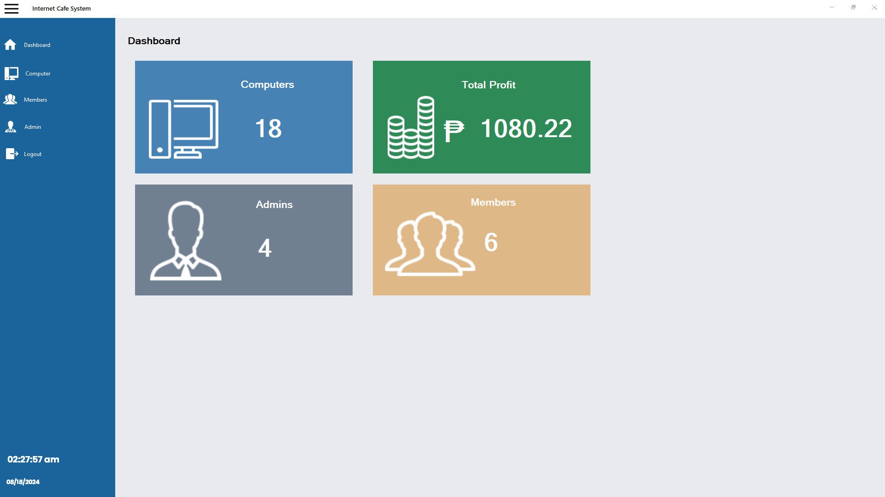
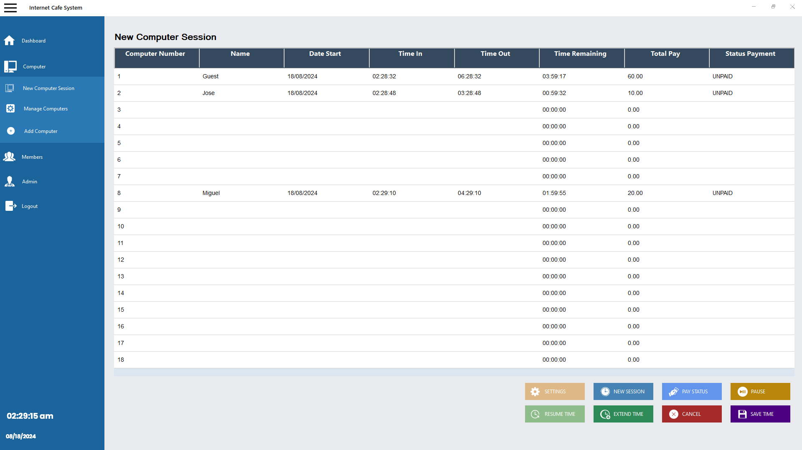
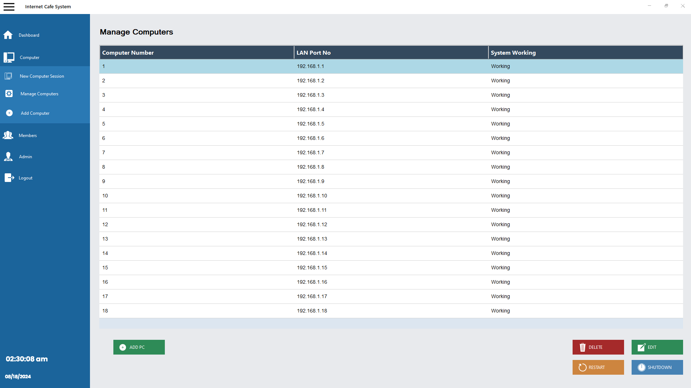
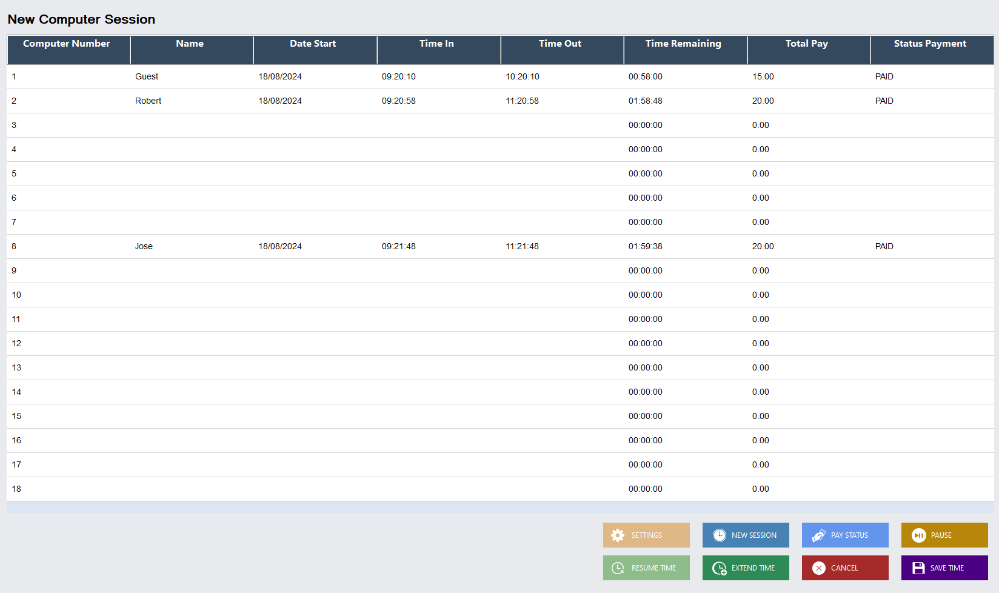

<p align="center">
  
</p>

<h2 align="center">NetSaga Internet Cafe System</h2>

---

## Info
NetSaga is an internet cafe management system built using C# and Windows Forms. It handles computer session tracking, billing, and remote PC control. The system includes automated session monitoring, auto-shutdown when time expires, and access restriction without active sessions. It also provides an admin dashboard for managing operations and users.

---

## Features
- Computer session tracking and time monitoring  
- Automated billing system based on usage  
- Membership system with stored user accounts  
- Remaining time carry-over for registered users  
- Remote PC control (shutdown, restart, session control)  
- Auto-shutdown when session time expires  
- Access restriction without active session  
- Admin dashboard with system overview  
- Computer management with LAN monitoring  
- User and admin management  
- Session history and payment tracking  

---

## Tech Stack
- Language: C#  
- Framework: Windows Forms (.NET)  
- Database: Microsoft SQL Server / LocalDB  
- IDE: Microsoft Visual Studio  

---

## Screenshots

### Dashboard Overview


### Session Management


### Computer Management


### Session Tracking Table


---

## Installation & Setup

### 1. Clone the Repository
```bash
git clone https://github.com/rass-dev/NetSaga-Internet-Cafe-System.git
cd NetSaga-Internet-Cafe-System
```

### 2. Open in Visual Studio
- Open Microsoft Visual Studio  
- Click "Open a project or solution"  
- Select the `.sln` file  

---

### 3. Restore Database (Using .bak File)

A pre-configured database backup is included in the project:

```
database/db_internet_cafe.bak
```

#### Steps:
1. Open SQL Server Management Studio (SSMS)  
2. Connect to your SQL Server instance  
3. Right-click **Databases** → Click **Restore Database**  
4. Select **Device** → Click **...** → Add the `.bak` file  
5. Choose `db_internet_cafe.bak`  
6. Set the database name (e.g. `NetSagaDB`)  
7. Click **OK** to restore  

---

### 4. Configure Connection String

Open `App.config` and update:

```xml
<connectionStrings>
  <add name="DefaultConnection"
       connectionString="Server=.;Database=NetSagaDB;Trusted_Connection=True;" />
</connectionStrings>
```

---

### 5. Run the Application
- Build the solution  
- Press **F5** or click **Start** to run  

---

## Usage

### Admin
- Monitor all computers and active sessions  
- Start, pause, extend, or end sessions  
- Control computers (shutdown/restart)  
- Manage users and admins  
- View reports and system activity  

### User
- Start a session on an available computer  
- Login as a registered member  
- Continue remaining time from previous sessions  
- Use allocated time based on balance  
- Session automatically ends when time expires  

---

## Membership System
NetSaga includes a membership system where users can register accounts and store their remaining time balance.

- Users can login before starting a session  
- Remaining time is saved and reusable  
- No need to consume all time in one session  
- Suitable for regular internet cafe customers  

---

## Notes
- Requires Microsoft Visual Studio to run  
- Ensure SQL Server or LocalDB is properly configured  
- A ready-to-use SQL Server backup file (`.bak`) is included in the `/database` folder  
- Application must run within the same local network for remote control features  
- Auto-shutdown feature depends on system permissions  

---
